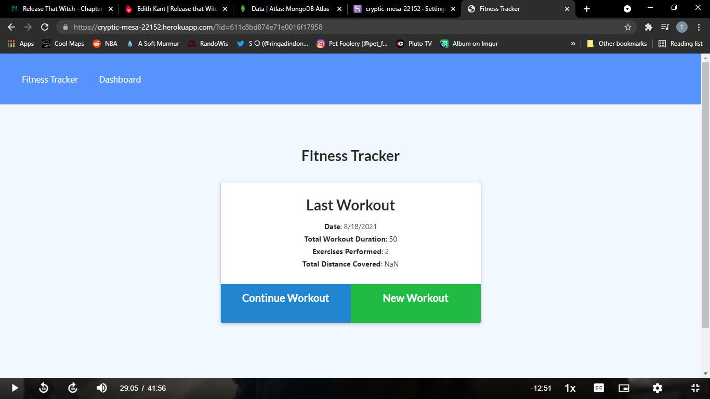
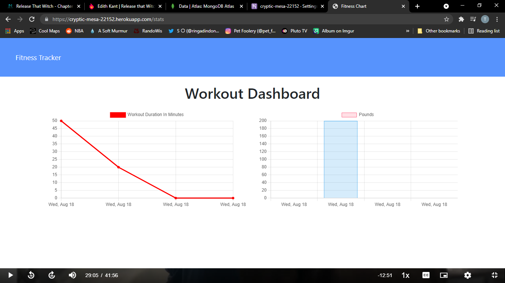
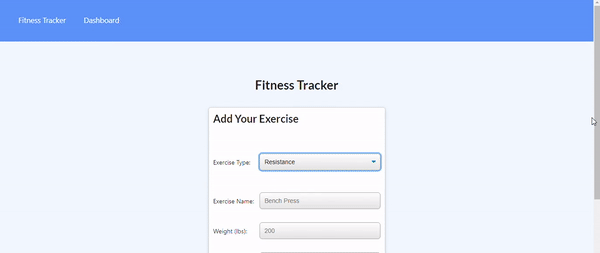

# Nosql-Homework-Workout-Tracker

Backend application using Mongo

👨[Github Profile](https://github.com/PratikPatel-Code/)

🏃[Deployed App](https://cryptic-mesa-22152.herokuapp.com/?id=611c8bd874e71e0016f17958)

#

## Table of Contents

- [Project Overview](#Overview)

- [Project Goals](#Goals)

- [Running App](#Running)

- [Testing App](#Testing)

- [Contributers](#Contributers)

- [Technologies](#Technologies)

- [Links](#Links)

#

## Overview:

An application that will let you add a workout and track it's completion. Uses various graphs to show results and progress.

#

## Goals:

1. When user enters site, they will have the option to create or resume a workout
2. If user creates a workout, they will be prompted to select cardio or resistence.
3. Upon selection, user will be able to select the workout and the various categories.
4. User can then add the workout, or choose complete.
5. Main page will show total workouts completed.
6. User get also track workouts that will be displayed in graphs, either line (cardio) or bar (resistence).

#

## Running: 🏃

- node.js must be installed
- Download the package.json
- run npm i
- npm run seed
- npm start

#

## Testing: 🔬

- Testing can be done on localhose:3005 by npm start

#

## Screenshot/Demo 📸

#

#

#

#

#

## Contributers:

👨[Pratik Patel](https://github.com/PratikPatel-Code/)

#

## Technologies: 💻

[Visual Studio](https://visualstudio.microsoft.com/)

[JavaScript](https://www.javascript.com/)

[Express](https://www.npmjs.com/package/express)

[Mongoose](https://www.npmjs.com/package/mongoose)

[Morgan](https://www.npmjs.com/package/morgan)

#

## Links: 🔗

✉️[Email](pratikpatel_85@yahoo.com)

👨[Github Profile](https://github.com/PratikPatel-Code/)

📁[Project Repo](https://github.com/PratikPatel-Code/Nosql-Homework-Workout-Tracker)
